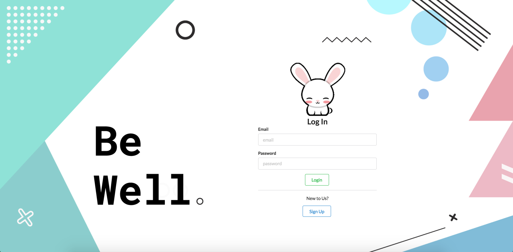

# Be Well
**Author:** Connie Wang

**Contact:** connie.wang303@gmail.com

## App Description
Be Well is built with principles of CBT, or Cognitive Behavioral Therapy and mindfulness techniques. CBT is the most widely used evidence-based practice for improving mental health, and is something that everybody can easily implement in their daily life. The hope is that through the use of Be Well, by tracking your mood and thoughts, you can increase self awareness, mindfulness, and emotional intelligence. Additionally, by linking these thoughts to your physical state, you can begin to identify thought patterns and emotional tendencies over time. 

## Core Features
Be Well provides several features to equip users with tools to track their own mental state and encourage positive thoughts and behaviors, such as:
* thought entries in which a user can reflect on a situation and identify cognitive distortions in their own thought process
* goal-tracking using the SMART model (Specific, Measureable, Achievable, Relevant, Time bound)
    * goal reflection upon goal completion
* variety of guided meditation sessions taken from the [UCLA Mindful Awareness Research Center](http://marc.ucla.edu/default.cfm)
* charts to visualize user data and trends
    * charts are built on [VictoryCharts](https://formidable.com/open-source/victory/)
* presence of a WellPal, an animated bunny whose state of health & happiness is determined from your user activity

***
### Contributors Guide
This project is licensed under the MIT license. See LICENSE.txt for more details.

Author: Connie Wang
